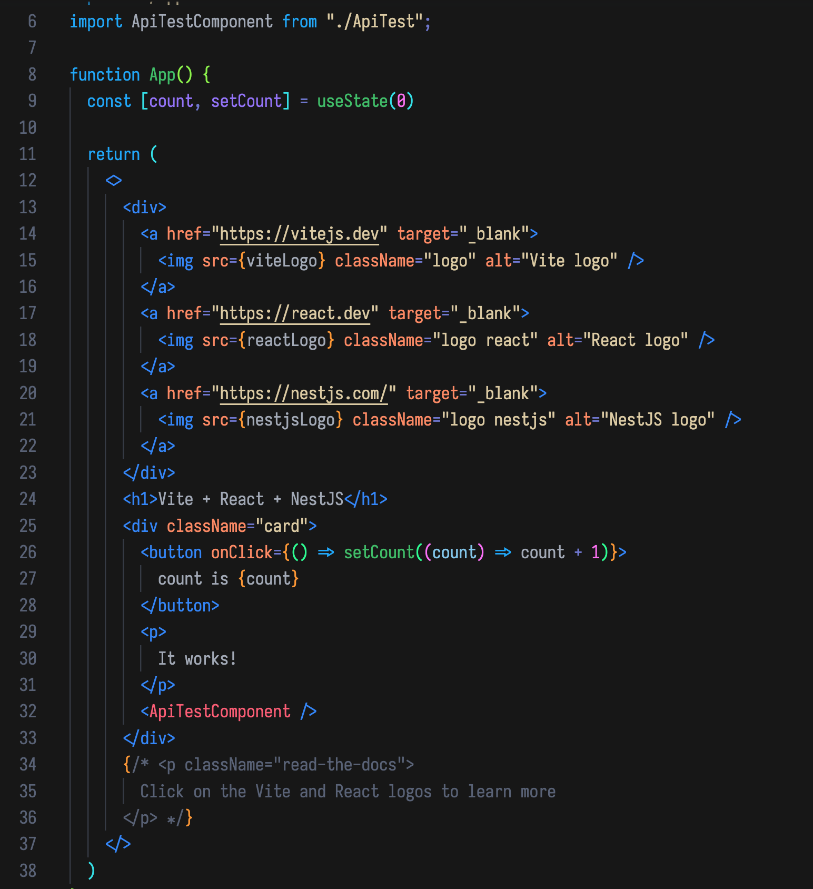
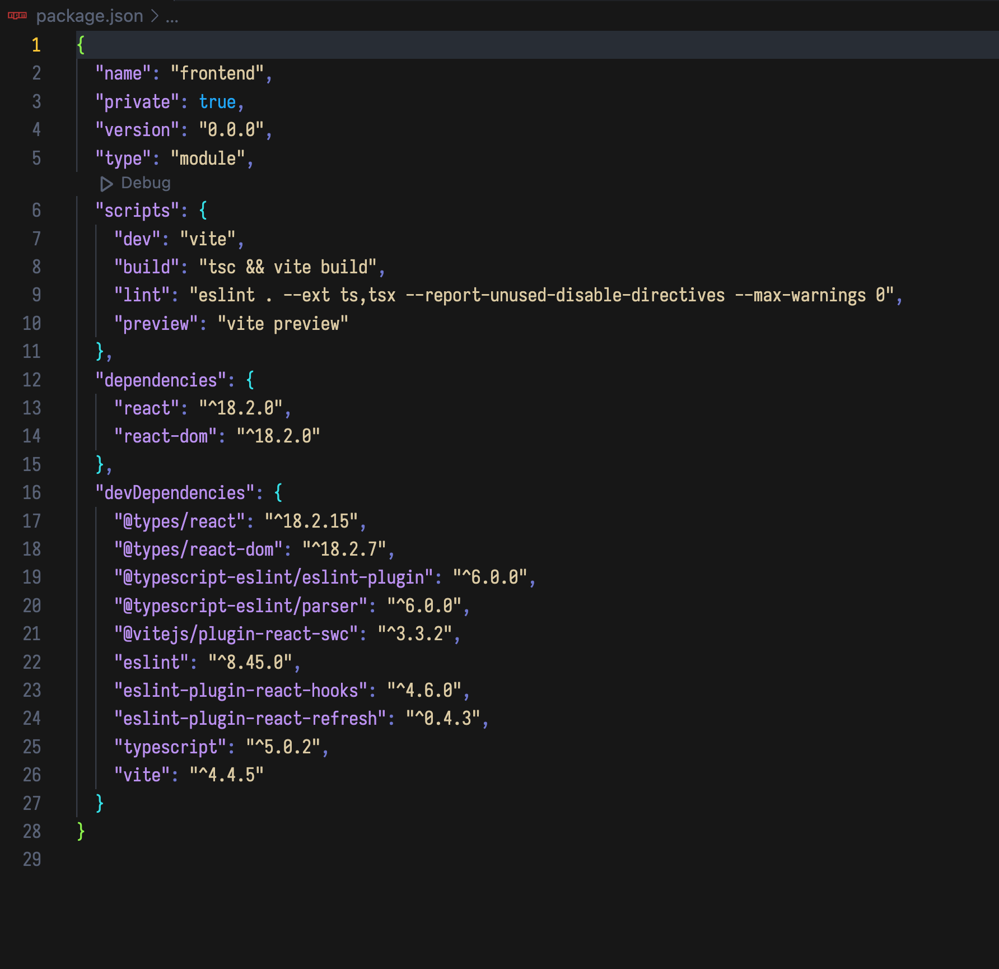

# Dark Panda Theme for VSCode README

## Working with Markdown

VSCode Dark Panda Theme by Pedro Arrioja

* Split the editor (`Cmd+\` on macOS or `Ctrl+\` on Windows and Linux).
* Toggle preview (`Shift+Cmd+V` on macOS or `Shift+Ctrl+V` on Windows and Linux).
* Press `Ctrl+Space` (Windows, Linux, macOS) to see a list of Markdown snippets.

## Recommended font: 
For those interested, I recommend using this elegant font called Losevka: https://github.com/be5invis/Iosevka
I’m using variance SS003
It supports ligatures and has this retro-80's look I really enjoy. 

## Some Screenshots: 

**Enjoy!**
